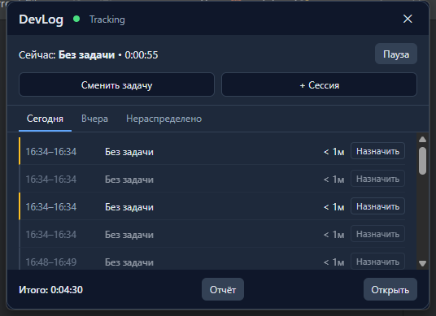

# Итерация 6 (Tauri) — полноценный Overlay

## Что сделано

- `tracking::pinned_task` — явное закрепление задачи (FR-06.10): хранится
  в `settings`, читается трекером на **каждый** poll (не кэш при старте,
  как whitelist/пороги — должно подействовать немедленно). Передаётся как
  `explicit_issue_key` в `git_context::resolve()` — параметр существовал с
  Итерации 3 (был зарезервирован ровно под эту задачу), использован
  впервые. "Завершить прежнюю сессию, начать новую" при смене задачи
  получилось без единой новой строчки в Session Engine — смена пина меняет
  ключ группировки, уже существующая логика разрыва run делает остальное.
- `shortcuts.rs` + `commands/shortcuts.rs` — переназначение глобального
  хоткея overlay (FR-06.2): живая перерегистрация без перезапуска,
  хранение в `settings`, чтение сохранённого значения при старте.
- `commands/windows.rs::show_main_window_command` — overlay просит Rust
  показать главное окно (для кнопок "Отчёт"/"Открыть").
- **`src/shared/api.ts` и `src/shared/hooks/useDaySessions.ts`** — вынесены
  из `main-window/` в `shared/`, т.к. overlay использует точно тот же
  сервис (буквальная реализация требования ТЗ раздела 6).
- `src/overlay/OverlayApp.tsx` — полный UI по макету из ТЗ (FR-06.6-8):
  статус/закрыть, текущая задача+таймер+Пауза, Сменить
  задачу/+Сессия, вкладки Сегодня/Вчера/Нераспределено, список сессий с
  инлайн-назначением issue, итог + Отчёт/Открыть.
- Settings: новая секция "Горячая клавиша overlay" (ввод + сохранение с
  живым применением и явной ошибкой при конфликте).

## Проверки и результаты

| Проверка | Команда | Результат |
|---|---|---|
| Rust typecheck | `cargo check` | ✅ |
| Rust lint | `cargo clippy --all-targets` | ✅ без предупреждений |
| Rust тесты | `cargo test` | ✅ 100/100 passed, 1 ignored (включая 5 новых тестов `pinned_task`) |
| Frontend typecheck | `npm run typecheck` | ✅ |
| Frontend lint | `npm run lint` | ✅ |

### Визуальная проверка

Overlay открыт через настоящий глобальный хоткей (не клик — после
находки в Итерации 5 про риск кликов мимо цели, здесь принципиально
использован хоткей, который по природе доставляется ОС независимо от
фокуса) и сфотографирован:

Макет соответствует примеру из ТЗ (раздел FR-06): статус "Tracking" с
зелёным индикатором, "Сейчас: Без задачи • 0:00:55", кнопки "Пауза",
"Сменить задачу", "+ Сессия", три вкладки, компактный список сессий с
кнопками "Назначить", подвал "Итого: 0:04:30" с "Отчёт"/"Открыть".

## Acceptance checklist (из тест-кейсов FR-06, раздел 9 ТЗ)

- [x] Редактирование при работающем трекере — тот же сервис/IPC, что и
  главное окно (буквально один и тот же `src/shared/api.ts`).
- [x] Отсутствие проекта — overlay корректно показывает "Без задачи", не
  выдумывает значение (видно на скриншоте).
- [x] Переключение задачи в активной сессии — реализовано через
  `pinned_task`, логика закрытия/открытия сессии покрыта существующими
  тестами Session Engine (смена ключа группировки уже тестировалась в
  Итерации 4); 5 новых unit-тестов на сам механизм хранения пина.
- [x] Сохранение после перезапуска — тот же БД/Session Engine слой, что
  уже проверен restart-safe в Итерациях 4/5.
- [x] Конфликт глобального shortcut — обрабатывается (предупреждение в
  консоль при старте; явная ошибка в Settings UI при живой
  перерегистрации).
- [~] Вызов поверх WebStorm на двух дисплеях / отключение монитора / DPI
  150% / быстрые повторные нажатия / Esc без потери правок / блокировка-
  разблокировка Windows — требуют реального второго монитора и
  интерактивной Windows-сессии, не воспроизводимы в этой среде
  автоматизации. **Чек-лист для ручной проверки ниже.**

## Чек-лист для ручной проверки

1. Открыть WebStorm (или любое приложение), нажать настроенный хоткей
   (по умолчанию `Ctrl+Alt+W`) — overlay появляется поверх него у правого
   верхнего края активного монитора.
2. На системе с двумя мониторами: открыть overlay, когда курсор на втором
   мониторе — убедиться, что overlay появляется на ТОМ ЖЕ мониторе, где
   курсор, не всегда на первом.
3. При масштабировании 125–150%: overlay должен быть виден целиком, не
   обрезан и не съезжать за край экрана (известное ограничение — overlay
   использует полные границы монитора, не workArea, см. Итерацию 0 — может
   на несколько пикселей перекрыть taskbar, это ожидаемо).
4. Нажать хоткей дважды быстро подряд — overlay должен открыться и
   закрыться без зависаний/дублирования окна.
5. Открыть overlay, нажать Escape — должен закрыться, не теряя
   несохранённых изменений (если такие были — в текущей версии все правки
   сохраняются сразу при действии, несохранённого состояния по сути нет).
6. Заблокировать Windows (`Win+L`) при открытом overlay, разблокировать —
   overlay должен остаться в прежнем состоянии (скрытым или открытым).
7. В Settings изменить горячую клавишу на что-то конфликтующее с другим
   приложением (например `Alt+Tab`) — должна появиться ошибка, старая
   комбинация должна продолжать работать.
8. Нажать "Сменить задачу" в overlay, ввести issue key — следующие
   записываемые события должны получить этот issueKey (проверить в
   Timeline главного окна после ~5-10 секунд).

## Оставшиеся риски / сознательно отложено

1. **Hide-on-blur не реализован** — FR-06.5 описывает это как опциональную
   настройку; текущее поведение (не скрывать при потере фокуса) и есть
   состояние "выключено", которое и так разумный дефолт — сам toggle не
   добавлен, т.к. нет острой необходимости для MVP.
2. **p95 время открытия overlay не измерено инструментально** — субъективно
   быстро (окно не пересоздаётся), но не профилировано.
3. **"Отчёт"/"Открыть" делают одно и то же** — полноценного Worklog
   Review ещё нет (Итерация 7/8), когда появится — "Отчёт" должен будет
   открывать именно его, а не просто показывать главное окно.
4. **Многомониторная/DPI/Escape-проверка** — не воспроизводима в этой
   среде автоматизации, вынесена в ручной чек-лист выше (та же ситуация,
   что и с треем в Итерации 0).

## Следующий шаг

Продолжаю без остановки — Итерация 7: Jira Integration + review (Cloud
provider, безопасное хранение токена, drafts, preview, POST worklog,
reconciliation).
